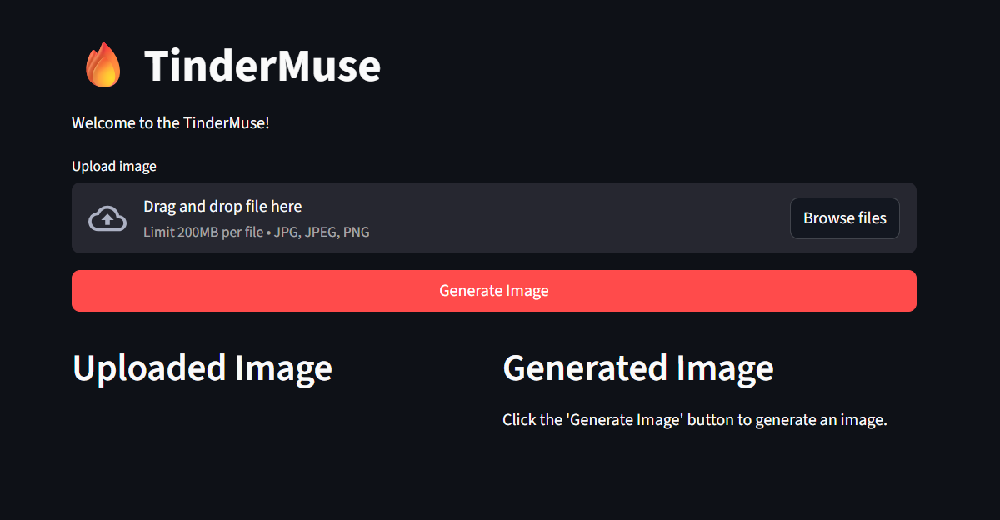
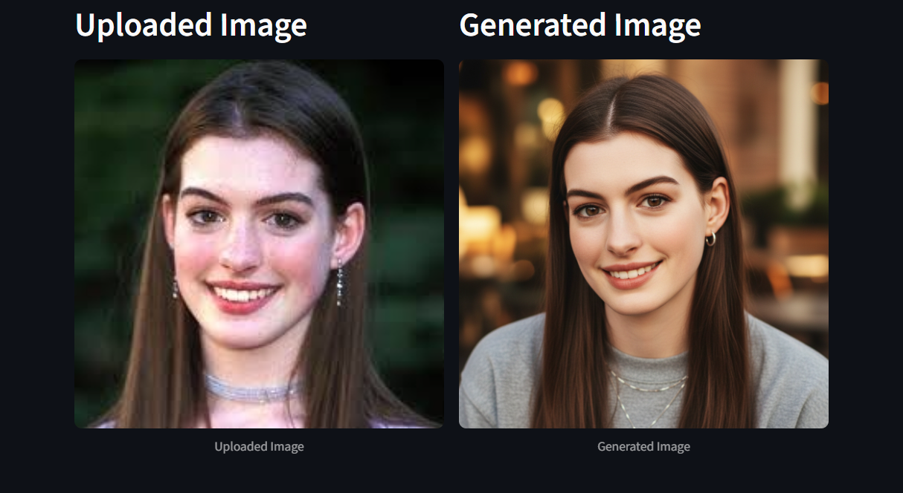
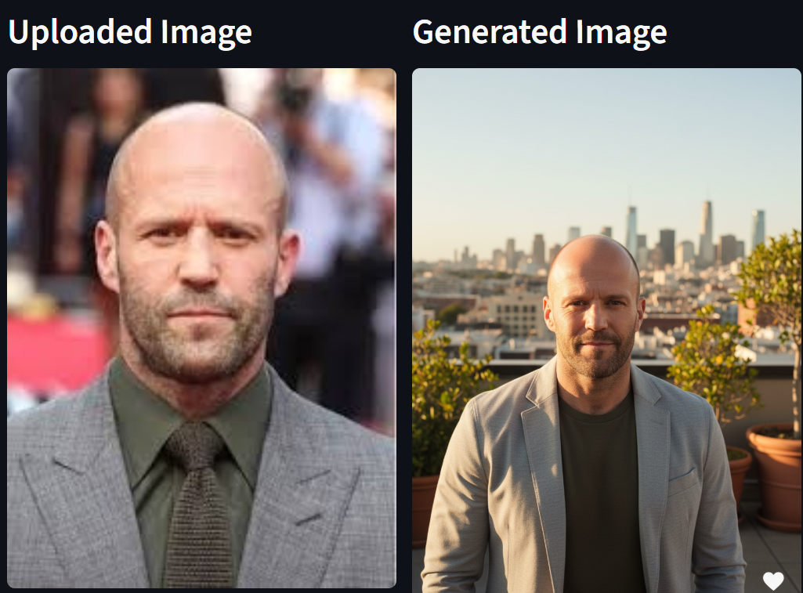
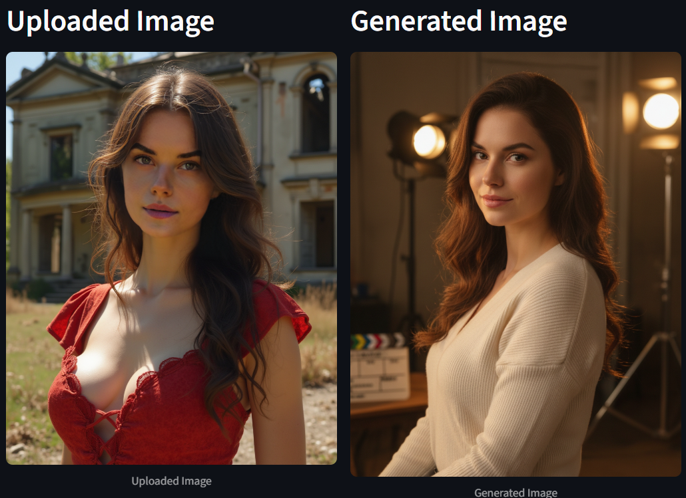

<div align="center">
  
  <h1 align="center">TinderMuse</h1>
  <p align="center">
    <strong>AI-Powered Profile Picture Enhancement for Dating Applications</strong>
  </p>
  <p align="center">
    <em>Transform ordinary photos into compelling dating profile pictures using advanced AI technology</em>
  </p>
</div>

---

## Overview

TinderMuse is a simple web application built with Streamlit that uses Google's Gemini 2.5 Flash Image Preview model to enhance profile pictures for dating applications. It provides a straightforward interface for AI-powered photo improvements through text prompts.

**Current Capabilities:**
- Add professional polish and artistic enhancement to existing photos
- Modify backgrounds and environmental settings
- Improve lighting conditions and overall photo quality
- Apply various aesthetic styles and filters
- Generate single enhanced images per processing cycle

**Note:** This application generates one enhanced image per request, as determined by the Gemini 2.5 Flash model's single-output design.

## Key Features

### AI Technology
- **Google Gemini 2.5 Flash**: Uses Google's image generation model for photo enhancement
- **Single Image Processing**: Generates one enhanced image per request
- **Prompt-Based Control**: Text descriptions guide the transformation process

### User Interface
- **Simple Web Interface**: Clean Streamlit-based design
- **File Upload**: Support for JPG, JPEG, and PNG formats
- **Side-by-Side View**: Compare original and enhanced images
- **Basic Controls**: Text prompt input and generate button

### Privacy & Security
- **Session-Based API Keys**: No permanent storage of credentials
- **No Image Storage**: Photos are not saved on the server
- **Direct API Processing**: Images processed through Google's secure API

## Application Preview

### User Interface
<div align="center">
  
  <p><i>Streamlined web interface featuring side-by-side comparison view</i></p>
</div>

### Transformation Examples
<div align="center">
  
  <p><i>Demonstration of AI-powered photo enhancement for dating profile optimization</i></p>
</div>

<div align="center">
  
  <p><i>Streamlined web interface featuring side-by-side comparison view</i></p>
</div>

<div align="center">
  
  <p><i>Streamlined web interface featuring side-by-side comparison view</i></p>
</div>

## Installation & Setup

### Prerequisites
- **Python 3.13+** (as specified in pyproject.toml)
- **uv package manager** (modern Python package and project manager)
- **Git** for repository cloning
- **Google AI API Key** (available through Google AI Studio)

### Installation Process

#### 1. Install uv Package Manager
    ```bash
# Install uv (if not already installed)
# On Windows:
powershell -c "irm https://astral.sh/uv/install.ps1 | iex"

# On macOS/Linux:
curl -LsSf https://astral.sh/uv/install.sh | sh
```

#### 2. Clone Repository
    ```bash
git clone https://github.com/HarshTomar1234/tindermuse.git
cd tindermuse
    ```

#### 3. Setup Project Environment
    ```bash
# Create virtual environment and install dependencies
uv sync

# Activate the virtual environment
# On Windows:
.venv\Scripts\activate
# On macOS/Linux:
source .venv/bin/activate
```

#### 4. Configure Google AI API
1. Navigate to [Google AI Studio](https://aistudio.google.com/app/apikey)
2. Authenticate with your Google account
3. Generate a new API key
4. Securely store the API key for application use

**Note**: Google AI API provides substantial free-tier usage limits suitable for personal and development purposes.

### Application Launch

#### 1. Start the Application
    ```bash
# Run the Streamlit application
uv run streamlit run main.py

# Alternative if uv run doesn't work:
    streamlit run main.py
    ```

#### 2. Access Web Interface
- Application launches automatically in your default browser
- Manual access: navigate to `http://localhost:8501`
- Interface loads with sidebar configuration and main processing area

#### 3. Initial Configuration
- Enter your Google AI API key in the sidebar settings panel
- API key is stored securely for the current session only
- Confirmation message appears upon successful key validation

## Usage Guide

### Core Workflow

**Image Upload Process:**
1. Use the file uploader to select your source image
2. Supported formats: JPG, JPEG, PNG (recommended max size: 10MB)
3. Uploaded image displays in the left column for reference

**Prompt Engineering:**
1. Compose your transformation description in the text area
2. Focus on specific, actionable instructions rather than vague requests
3. Consider lighting, background, style, and mood in your descriptions

**Image Generation:**
1. Click "Generate Image" to initiate AI processing
2. Processing typically completes within 15-45 seconds
3. Enhanced image appears in the right column for comparison

**Result Management:**
1. Right-click the generated image to save locally
2. For different variations, modify your prompt and run a new generation
3. Each request produces one enhanced image only

### Advanced Prompt Engineering

#### Professional Enhancement Prompts
```
Professional Photography Style:
"Transform this into a professional headshot with studio lighting, clean background, and polished appearance suitable for LinkedIn or dating profiles"

Environmental Enhancement:
"Enhance this photo with golden hour lighting, soften the background with bokeh effect, and improve overall color grading for a warm, inviting feel"

Artistic Transformation:
"Convert this to a cinematic portrait with dramatic side lighting, desaturated colors, and film grain texture for an artistic, editorial look"
```

#### Background and Atmosphere Modifications
```
Urban Professional:
"Place this person in a modern urban setting with soft city bokeh background, maintaining natural lighting and professional appearance"

Natural Environment:
"Relocate to an outdoor setting with natural lighting, green foliage background, and enhance overall warmth and vibrancy"

Studio Setting:
"Create a clean studio environment with gradient background, professional portrait lighting, and minimal shadows"
```

#### Technical Quality Improvements
```
Lighting Enhancement:
"Improve facial lighting with soft, even illumination, reduce harsh shadows, and enhance skin tone for a natural, flattering appearance"

Resolution and Clarity:
"Enhance image sharpness, improve detail definition, and optimize color balance while maintaining natural skin texture"
```

### Optimization Guidelines

**Source Image Requirements:**
- Minimum resolution: 512x512 pixels (higher resolution yields better results)
- Well-lit subjects with clear facial features produce optimal outcomes
- Avoid heavily compressed or low-quality source images
- Single-person portraits work best for dating profile applications

**Prompt Effectiveness:**
- Specific descriptions yield more predictable results than generic requests
- Include technical photography terms (lighting, composition, background)
- Specify desired mood and aesthetic style
- Avoid conflicting instructions within a single prompt

## Technical Specifications

### Project Dependencies
| Package | Version Requirement | Function |
|---------|-------------------|----------|
| **Python** | >=3.13 | Runtime environment |
| **Streamlit** | >=1.49.1 | Web application framework |
| **Google Generative AI** | >=1.38.0 | AI model integration and processing |

### System Requirements
- **Memory**: 4GB RAM minimum (8GB recommended for optimal performance)
- **Storage**: Approximately 500MB for complete installation
- **Network**: Stable internet connection required for API communication
- **Browser Compatibility**: Modern browsers (Chrome 90+, Firefox 88+, Safari 14+, Edge 90+)

### API Specifications
- **Service Provider**: Google AI Platform
- **Model**: Gemini 2.5 Flash Image Preview
- **Rate Limiting**: Standard free-tier limitations (typically 60 requests/minute)
- **Input Constraints**: Maximum 10MB per image file
- **Output Format**: Single enhanced image per generation cycle

### Application Constraints
- **Single Image Generation**: The Gemini 2.5 Flash model produces one image per API request
- **Sequential Processing**: Multiple variations require separate manual requests
- **Basic Interface**: Simple prompt-based interaction without advanced UI controls
- **Session Storage Only**: No persistent data storage between sessions

## Troubleshooting

### Common Issues and Resolutions

#### API Authentication Problems
**Issue**: "Invalid API Key" or authentication failures
**Resolution**:
1. Verify API key accuracy (no extra spaces or characters)
2. Confirm API key is active in Google AI Studio
3. Generate a new API key if the current one is expired
4. Ensure proper network connectivity for API validation

#### Environment Setup Issues
**Issue**: Package installation or environment problems
**Resolution**:
```bash
# Verify uv installation
uv --version

# Recreate virtual environment
uv venv --force
uv sync

# Alternative manual setup
python -m venv .venv
source .venv/bin/activate  # macOS/Linux
.venv\Scripts\activate     # Windows
uv pip install -r requirements.txt
```

#### Application Launch Problems
**Issue**: Streamlit application fails to start
**Resolution**:
```bash
# Check port availability
netstat -an | findstr 8501  # Windows
netstat -an | grep 8501     # macOS/Linux

# Use alternative port
uv run streamlit run main.py --server.port 8502

# Force browser opening
uv run streamlit run main.py --server.headless false
```

#### Image Processing Issues
**Issue**: Poor quality results or processing failures
**Resolution**:
- Ensure source images meet minimum quality standards (512x512px+)
- Optimize image file size (under 10MB recommended)
- Refine prompt specificity and technical language
- Verify stable internet connection for API communication

### Performance Optimization
- **Memory Management**: Close unnecessary applications during processing
- **Network Optimization**: Use stable, high-speed internet connection
- **Image Preparation**: Resize oversized images before upload
- **Prompt Efficiency**: Use precise, technical language in descriptions

## Deployment Options

### Cloud Platform Deployment

#### Streamlit Cloud
```bash
# Prerequisites: GitHub repository with TinderMuse code
1. Connect repository to Streamlit Cloud (https://streamlit.io/cloud)
2. Configure secrets management with GOOGLE_API_KEY
3. Deploy with automatic domain and SSL certificate
```

#### Heroku Platform
```bash
# Install Heroku CLI and configure
heroku create your-tindermuse-app
echo "web: streamlit run main.py --server.port \$PORT" > Procfile
heroku config:set GOOGLE_API_KEY=your_api_key_here
git push heroku main
```

#### Docker Containerization
```dockerfile
FROM python:3.13-slim
WORKDIR /app

# Install uv package manager
RUN pip install uv

# Copy project files
COPY pyproject.toml uv.lock ./
COPY main.py ./

# Install dependencies
RUN uv sync --frozen

# Expose Streamlit port
EXPOSE 8501

# Run application
CMD ["uv", "run", "streamlit", "run", "main.py", "--server.address", "0.0.0.0"]
```

## Development & Contribution

### Contributing Guidelines

**Development Workflow:**
1. Fork repository and create feature branch
2. Implement changes following project coding standards
3. Test functionality with various image types and prompts
4. Submit pull request with detailed description

**Code Quality Standards:**
- Adhere to PEP 8 Python style guidelines
- Implement comprehensive error handling
- Include inline documentation for complex logic
- Maintain backward compatibility when possible

**Potential Enhancement Areas:**
- User interface improvements and styling
- Better error handling and user feedback
- Prompt history and favorites
- Basic image preprocessing options

### Project Status

**Current Version (v1.0):**
- Single image processing with Gemini 2.5 Flash
- Basic prompt engineering interface
- Session-based API key management
- Simple web interface with side-by-side comparison

This is a straightforward implementation focused on core functionality rather than advanced features.

## Support & Resources

### Documentation
- **Technical Reference**: Inline code documentation and comments
- **API Documentation**: Google AI Platform documentation
- **Framework Reference**: Streamlit official documentation

### Community Support
- **Issue Tracking**: GitHub Issues for bug reports and feature requests
- **Discussion Forums**: GitHub Discussions for community interaction
- **Version Updates**: GitHub Releases for changelog and updates

### Contact Information
For technical support, feature requests, or collaboration inquiries:
- **Repository**: [GitHub - TinderMuse](https://github.com/HarshTomar1234/tindermuse)
- **Issues**: [Report Problems](https://github.com/HarshTomar1234/tindermuse/issues)
- **Discussions**: [Community Forum](https://github.com/HarshTomar1234/tindermuse/discussions)

## Legal & Licensing

### Open Source License
This project operates under the **MIT License**, providing broad permissions for use, modification, and distribution. Full license terms are available in the LICENSE file.

### Dependency Licensing
- **Streamlit**: Apache License 2.0
- **Google Generative AI**: Governed by Google AI Platform Terms of Service
- **Python Standard Library**: Python Software Foundation License

### Usage Responsibilities
Users of TinderMuse are responsible for:
- Ensuring appropriate rights to uploaded images
- Compliance with applicable platform terms of service
- Ethical use of AI-generated content
- Respect for privacy and consent in image processing

### Disclaimer
TinderMuse is provided as-is for educational and personal use. The developers assume no responsibility for misuse, content violations, or platform policy infractions resulting from generated images.

---

<div align="center">
  <p><strong>TinderMuse - AI-Powered Profile Enhancement</strong></p>
  <p>
    Developed by Harsh Tomar | 
    <a href="https://github.com/HarshTomar1234">GitHub Profile</a>
  </p>
</div>
